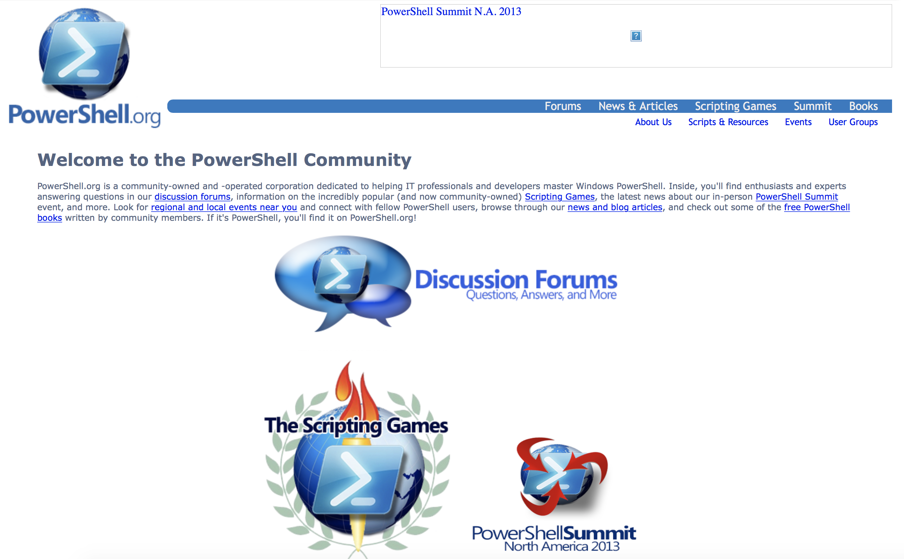
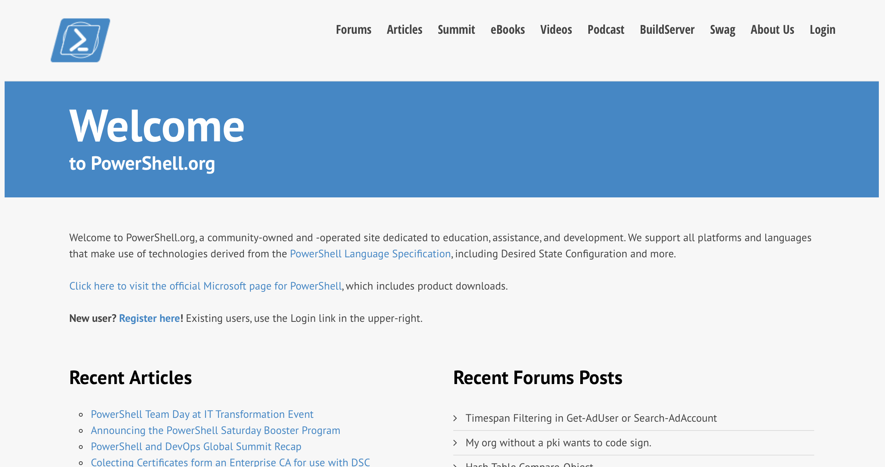

# A Fresh Start
I knew that a credible community effort would take a lot more than myself, and I knew my stepping away from PoshComm.org had probably damaged my own credibility. So I sought the advice and help of several other MVPs. I bought the PowerShell.org domain (when I explained what I was doing, the owner was very reasonable about the price), we managed to get a redirection notice on PoshComm.org, and we set up the first iteration of PowerShell.org. 

The first iteration was admittedly rough. We used Wordpress for the blogging and articles side, and a PHP-based forums software for Q&A forums. Our hope was that lots of folks would take up writing articles on the site, something which never really came true. My suspicion is that most people would rather blog under their own "brand," which I completely understand. I'd hoped that, by providing an instant and large audience, we'd be an attractive place for people to contribute, but even today in 2018 that's not really happened.

We also took over The Scripting Games from Microsoft's "Scripting Guy" of the time, Ed Wilson. Ed was just overwhelmed with the Games' popularity, and we successfully ran a fairly extensive Games program for a couple of years until we, too, became overwhelmed with the amount of work involved.

Over time, we got our stuff together. We migrated the forums into Wordpress' bbPress forums, which gave the whole site a much cleaner and more unified look, and gave people a single logon if they did want to contribute articles as well as post in the forums.

This is where I learned a third lesson: _not everyone who contributes meaningfully to a community is going to do so in the same way_. I have a set of bookmarks that I open in my browser every morning, and one of them was now for PowerShell.org's forums. I wanted to make sure every question had an answer if I possibly could. However, the colleagues helping me run the organization weren't that interested in a daily routine of Q&A monitoring. So we started to divvy up the responsibilities amongst us; one of us focused mainly on the forums. Another focused on events like Scripting Games. Another handled our finances, as we were essentially paying for everything out-of-pocket at first. We divvied up the legal responsibilities, as well, since our state of incorporation, Nevada, required a President, Secretary, and Treasurer to be on the records.

We all promised we wouldn't step away from the thing for at least five years, and we stuck to that and then some. So with PowerShell.org running, it was time to start making it actually work.
